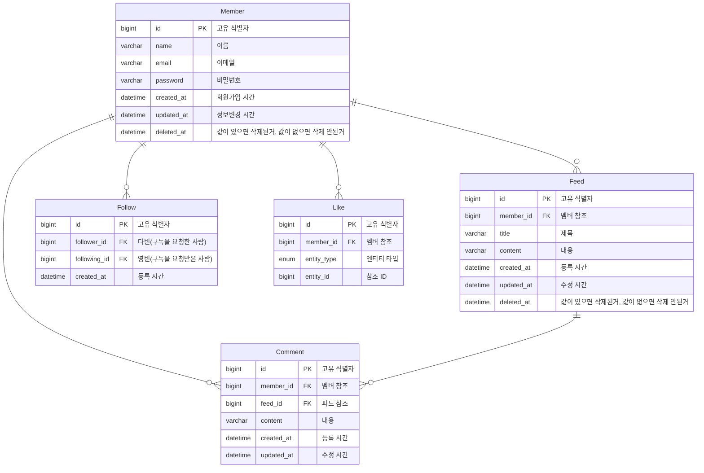

# WantToGram

## 🫴 Introduce

## 👨‍👨‍👦‍👦 Member

<table align="center">
    <thead>
        <tr>
            <th>👑 팀장</th>
            <th>팀원</th>
            <th>팀원</th>
            <th>팀원</th>
        </tr>
    </thead>
    <tbody>
        <tr>
            <td align="center"></td>
            <td align="center"></td>
            <td align="center"></td>
            <td align="center"></td>
        </tr>
        <tr>
            <td align="center">임영빈</td>
            <td align="center">이승찬</td>
            <td align="center">김다빈</td>
            <td align="center">김호진</td>
        </tr>
    </tbody>
</table>

## ERD 설계

## Api 명세서
