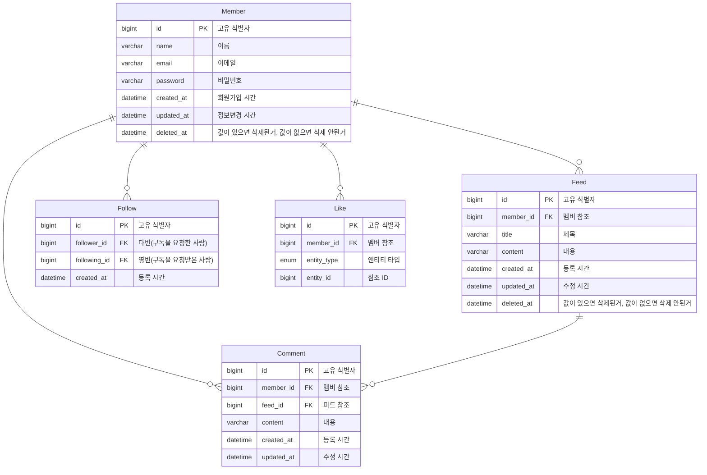

# WantToGram

## 🫴 Introduce
**WantToGram**은 사용자 간의 연결과 소통을 위한 소셜 미디어 플랫폼입니다.  
게시글을 통해 일상을 공유하고, 편리하게 친구들과 소통할 수 있습니다.  

  **팀명**: 12조(십이조) → 시시비비(**是是非非)**  
  **팀 소개**: 의미없이 딸깍 코드를 작성하지 않고 시시비비를 가리며 성장하는 팀.
  
### 주요 기능
- **게시글 작성**: 쉽고 빠르게 콘텐츠를 공유하세요.
- **댓글 및 좋아요**: 친구들과 소통을 이어가세요.
- **검색 기능**: 관심 있는 사람이나 게시글을 찾아보세요.   (엔터 어캐해용)  

### 프로젝트 동기
**WantToGram**은 소셜 미디어의 복잡함에서 벗어나, 사용자 중심의 간단하고 직관적인 서비스를 제공하기 위해 시작되었습니다.

이 프로젝트는 Spring Data JPA를 사용하여 MySQL DB에 접근하며, 회원과 피드 및 댓글에 대한 CRUD (생성, 조회, 수정, 삭제),  
회원 팔로우, 좋아요 표시 작업을 수행하는 RESTful API를 제공합니다.  

**프로젝트 기간**: 2024.12.20 ~ 2024.12.27  
**기술 스택**:
- Java 17  
- Spring Boot 3.4.0  
- Spring Data JPA  
- MySQL 8.0
- AWS E2C

### 🗃️ Git 컨벤션
**feat** : 새로운 기능 추가  
**fix** : 버그 수정  
**refactor** : 코드 리팩토링  
**docs** : 문서 변경  
**style** : 스타일 수정, 줄 바꿈, 공백, 세미콜론 누락 등  
**test** : 테스트 추가, 테스트 리팩토링 등 production 코드에 대한 변경 없음  
**chore** : 기타 변경사항(빌드 프로세스 수정, 패키지 매니저 수정, assets 수정 등)  
```
[title]
feat: 검색 API 기능 추가

[body]
- 현재 위치와 검색한 주소를 기준으로 거리 계산
- 위,경도 값을 갖고 역지오코딩을 통해 주소값을 구함
```

## 👨‍👨‍👦‍👦 Member

<table align="center">
    <thead>
        <tr>
            <th>👑 팀장</th>
            <th>팀원</th>
            <th>팀원</th>
            <th>팀원</th>
        </tr>
    </thead>
    <tbody>
        <tr>
            <td align="center"><a href="https://github.com/yeongbinim"></a></td>
            <td align="center"><a href="https://github.com/tmdcksdl"></a></td>
            <td align="center"><a href="https://github.com/answerin1"></a></td>
            <td align="center"><a href="https://github.com/Hojin02"></a></td>
        </tr>
        <tr>
            <td align="center">임영빈</td>
            <td align="center">이승찬</td>
            <td align="center">김다빈</td>
            <td align="center">김호진</td>
        </tr>
    </tbody>
</table>

## ERD 설계




## Api 명세서
