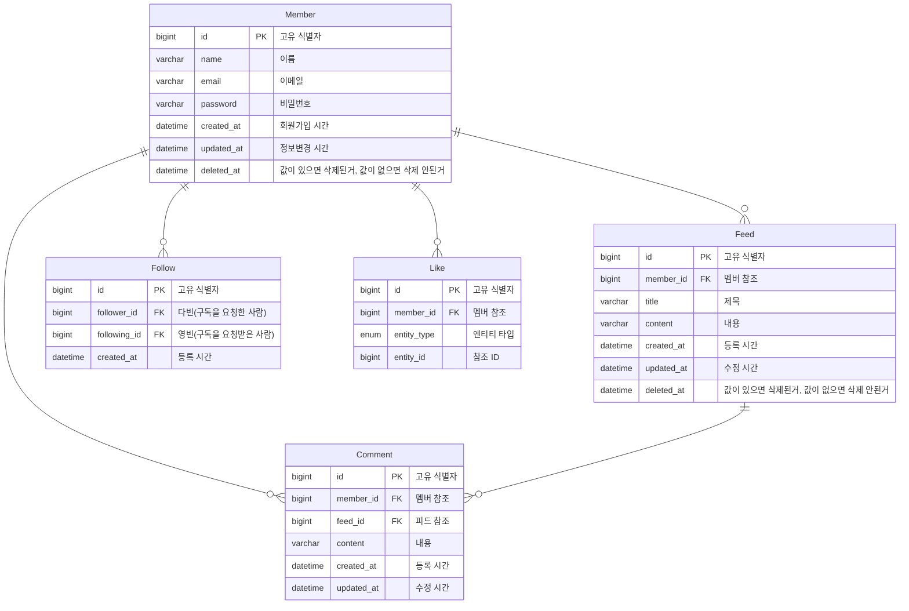

# WantToGram
**WantToGram**은 사용자 간의 연결과 소통을 위한 소셜 미디어 플랫폼입니다.  
게시글을 통해 일상을 공유하고, 편리하게 친구들과 소통할 수 있습니다.  

## 🗒︎ Index
  -  🫴 [소개](#introduce)
  -  🗃️ [Git 컨벤션](#gitcon)
  -  📊 [ERD](#erd)
  -  🌐 [API 명세](#api)
  -  ⚠️ [트러블 슈팅](#trouble)
  -  😼 [후기](#review)

  
<a id="introduce"></a>
## 🫴 Introduce

  **팀명**: 12조(십이조) → 시시비비(**是是非非**)  
  **팀 소개**: 의미없이 딸깍 코드를 작성하지 않고 시시비비를 가리며 성장하는 팀.
  
### ⚙ 주요 기능
- **게시글 작성**: 쉽고 빠르게 콘텐츠를 공유하세요.
- **댓글 및 좋아요**: 친구들과 소통을 이어가세요.
- **검색 기능**: 관심 있는 사람이나 게시글을 찾아보세요.

### 🏝 프로젝트 동기
**WantToGram**은 소셜 미디어의 복잡함에서 벗어나, 사용자 중심의 간단하고 직관적인 서비스를 제공하기 위해 시작되었습니다.

이 프로젝트는 Spring Data JPA를 사용하여 MySQL DB에 접근하며, 회원과 피드 및 댓글에 대한 CRUD (생성, 조회, 수정, 삭제),  
회원 팔로우, 좋아요 표시 작업을 수행하는 RESTful API를 제공합니다.  

**📅 프로젝트 기간**: 2024.12.20 ~ 2024.12.27  
**기술 스택**:
- Java 17  
- Spring Boot 3.4.0  
- Spring Data JPA  
- MySQL 8.0
- AWS E2C
- 
<a id="gitcon"></a>
### 🗃️ Git 컨벤션
**feat** : 새로운 기능 추가  
**fix** : 버그 수정  
**refactor** : 코드 리팩토링  
**docs** : 문서 변경  
**style** : 스타일 수정, 줄 바꿈, 공백, 세미콜론 누락 등  
**test** : 테스트 추가, 테스트 리팩토링 등 production 코드에 대한 변경 없음  
**chore** : 기타 변경사항(빌드 프로세스 수정, 패키지 매니저 수정, assets 수정 등)  
```
[title]
feat: 검색 API 기능 추가

[body]
- 현재 위치와 검색한 주소를 기준으로 거리 계산
- 위,경도 값을 갖고 역지오코딩을 통해 주소값을 구함
```
<a id="member"></a>
## 👨‍👨‍👦‍👦 Member

<table align="center">
    <thead>
        <tr>
            <th>👑 팀장</th>
            <th>팀원</th>
            <th>팀원</th>
            <th>팀원</th>
        </tr>
    </thead>
    <tbody>
        <tr>
            <td align="center"><a href="https://github.com/yeongbinim"></a></td>
            <td align="center"><a href="https://github.com/tmdcksdl"></a></td>
            <td align="center"><a href="https://github.com/answerin1"></a></td>
            <td align="center"><a href="https://github.com/Hojin02"></a></td>
        </tr>
        <tr>
            <td align="center">임영빈</td>
            <td align="center">이승찬</td>
            <td align="center">김다빈</td>
            <td align="center">김호진</td>
        </tr>
    </tbody>
</table>

<a id="erd"></a>
## 📊 ERD 설계



<a id="api"></a>
## 🌐 Api 명세서
회원(Member), 피드(Feed), 댓글(Comment), 팔로우(Follow), 좋아요(Like)와 관련된 RESTful API를 제공합니다.  
각 기능에 대해 CRUD(생성, 조회, 수정, 삭제) 작업을 지원하며, JSON 형식의 요청과 응답을 기반으로 동작합니다.  
[상세api확인을 위해 여기를 클릭해주세요](https://teamsparta.notion.site/1622dc3ef51481ca9bb0d64dd3f4d087?v=1622dc3ef51481a489b5000ce8b50033)

<a id="trouble"></a>
## ⚠️ 트러블 슈팅

### 설계 과정에서의 트러블
####  [📊 좋아요 Entity를 어떻게 설계하지](https://teamsparta.notion.site/Entity-abf4ad96c35645928ebb22a83c96fcb5)

### 개발 과정에서의 트러블
####  [🗌 이게 왜 빈 배열이지? 날짜가...](https://teamsparta.notion.site/0f40bc61d91345a1845e5957b9a7a460)

### 협업 과정에서의 트러블
#### [💥 악 충돌이다..](https://teamsparta.notion.site/9fa180056dfe492cb5f364ee3a972a27)

<a id="review"></a>
## 😼 후기
<table>
    <tr>
        <!-- 프로필 -->
        <td align="center" style="width: 150px;">
            <a href="https://github.com/yeongbinim">
                
            </a>
            <p><b>👑 임영빈</b></p>
        </td>
        <td>
	 <p>
                팀장으로써 성실하고 열정적인 팀원들을 만나는게 얼마나 큰 행운인지 알게되는 시간이었다.<br>
		짧은 기간이라 기술적인 도전이 많이 못 들어간건 아쉽지만,<br>
		팀 목표를 달성하기 위해 어떻게 협업을 해야할지 인사이트를 많이 얻을 수 있어서 너무 좋았다.
            </p>
        </td>
    </tr>
   <tr>
        <!-- 프로필 -->
        <td align="center" style="width: 150px;">
            <a href="https://github.com/Hojin02">
                
            </a>
            <p><b>김호진</b></p>
        </td>
        <!-- 후기 -->
        <td>
            <p>
                혼자 했던 과제를 팀원과 함께 하는 프로젝트라서 걱정이 많았다. 내가 못 따라가면 어쩌지 너무 어려우면 어쩌지 했지만, <br>
                영빈님이 팀을 잘 이끌어 주셨고, 팀원 모두 말똥말똥하는 눈으로 집중하고 있었다! 덕분에 분위기도 너무 좋았고, <br>
                힘들 때 서로 화이팅이라는 말 한마디와 가끔씩 농담도 주고받으며 힘을 얻어 개발할 수 있었다.<br>
		다양한 상황에서 Git 해결 방법과, 내가 하던 방법 말고도 다른 스타일도 많이 배울 수 있었고, <br>
                차근차근하다 보니 어렵지 않게 할 수 있었다! 우리 팀 최고!<br>
            </p>
        </td>
    </tr>
    <tr>
        <!-- 프로필 -->
        <td align="center" style="width: 150px;">
            <a href="https://github.com/tmdcksdl">
                
            </a>
            <p><b>이승찬</b></p>
        </td>
        <!-- 후기 -->
        <td>
            <p>
                Spring을 처음 배우고 진행한 프로젝트였는데, 팀원분들 덕분에 정말 많은 것을 배울 수 있었습니다! <br>
		GitHub을 활용한 협업은 처음이라 약간 걱정했지만, 생각보다 어렵지 않았고 협업의 중요성과 힘을 느낄 수 있었습니다.  <br>
		12조 최고!!!
            </p>
        </td>
    </tr>
    <tr>
        <!-- 프로필 -->
        <td align="center" style="width: 150px;">
            <a href="https://github.com/answerin1">
                
            </a>
            <p><b>김다빈</b></p>
        </td>
        <!-- 후기 -->
        <td>
            <p>
                오랜만에 팀 프로젝트를 수행하며  crud에 대한 코드를 한 번 더 익힐 수 있었다. <br>
		또한 협업의 힘이 대단하다는 것을 다시 한 번 알게 되었다. <br>
		고생한 12조에게 감사함을 전하고 싶다.
            </p>
        </td>
    </tr>
</table>


